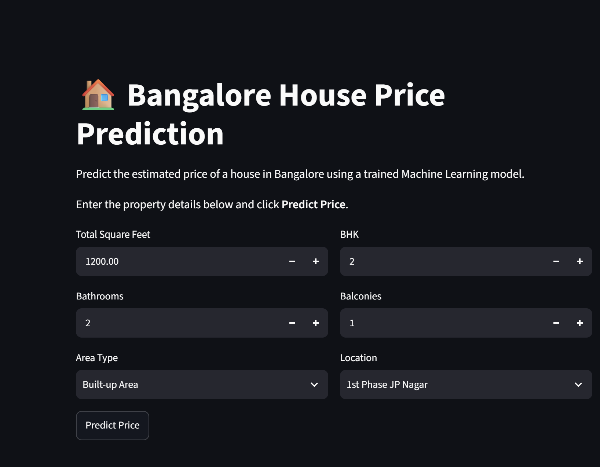
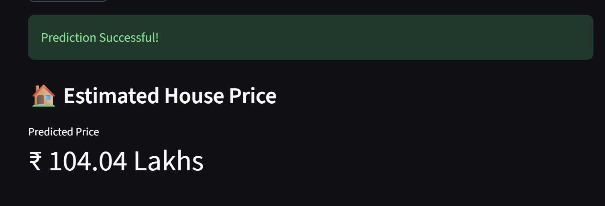

<h1 align="center">🏠 Bangalore House Price Prediction</h1>

<p align="center">
An end-to-end Machine Learning web application that predicts house prices in Bangalore using Linear Regression and Streamlit.
</p>

<p align="center">
  
  
  
  
  
  
</p>

---

# 📖 Overview

This project predicts the estimated price of residential properties in Bangalore based on property details such as:

- 📍 Location
- 🏠 Area Type
- 📐 Total Square Feet
- 🛏 Number of Bedrooms (BHK)
- 🚿 Number of Bathrooms
- 🌇 Number of Balconies

The model was trained using the **Bengaluru House Price Dataset** after extensive data cleaning, feature engineering, and outlier removal.

The trained model is deployed as an interactive **Streamlit** web application.

---

# ✨ Features

- 🏠 Real-time house price prediction
- 📍 Location-based prediction
- 📊 Interactive Streamlit web interface
- 🧹 Missing value handling
- ⚙ Feature engineering (`sqft_per_bhk`)
- 📌 One-Hot Encoding
- 📈 Linear Regression model
- 💾 Pickle model serialization
- 🚀 Instant prediction

---

# 🛠 Tech Stack

| Category | Technologies |
|-----------|--------------|
| Programming Language | Python |
| Data Analysis | Pandas, NumPy |
| Machine Learning | Scikit-learn |
| Web Framework | Streamlit |
| Model Storage | Pickle |
| Configuration | JSON |
| Development | Jupyter Notebook |

---

# 📊 Machine Learning Pipeline

```text
Raw Dataset
      │
      ▼
Data Cleaning
      │
      ▼
Missing Value Handling
      │
      ▼
Feature Engineering
      │
      ▼
Outlier Removal
      │
      ▼
One-Hot Encoding
      │
      ▼
Train-Test Split
      │
      ▼
Linear Regression Model
      │
      ▼
Model Evaluation
      │
      ▼
Saved Model (.pkl)
      │
      ▼
Streamlit Web App
```

---

# 📈 Model Performance

| Metric | Value |
|--------|------:|
| Model | Linear Regression |
| R² Score | **0.856** |
| Cross Validation Score | **0.858** |

---

# 📸 Application Screenshots






---

# 📂 Project Structure

```text
Bangalore-House-Price-Prediction/
│
├── assets/
│   ├── input-form.png
│   └── prediction-result.png
│
├── data/
│   └── Bengaluru_House_Data.csv
│
├── models/
│   ├── bangalore_house_price_model.pkl
│   └── columns.json
│
├── notebooks/
│   └── Bangalore_House_Price_Prediction.ipynb
│
├── app.py
├── requirements.txt
├── README.md
├── LICENSE
└── .gitignore
```

---

# 🚀 Installation

### Clone the repository

```bash
git clone https://github.com/AnkushSharma5/Bangalore-House-Price-Prediction.git
```

### Navigate to the project folder

```bash
cd Bangalore-House-Price-Prediction
```

### Install dependencies

```bash
pip install -r requirements.txt
```

### Run the application

```bash
streamlit run app.py
```

or

```bash
py -m streamlit run app.py
```

---

# 💻 How to Use

1. Enter the Total Square Feet.
2. Select the Number of BHK.
3. Enter the Number of Bathrooms.
4. Enter the Number of Balconies.
5. Select the Area Type.
6. Select the Property Location.
7. Click **Predict Price**.
8. View the estimated house price.

---

# 🔮 Future Improvements

- Implement Random Forest and XGBoost models
- Hyperparameter tuning
- Interactive price trend visualization
- Google Maps integration
- Cloud deployment using Docker
- Model comparison dashboard

---

# 👨‍💻 Author

**Ankush Sharma**

🎓 B.E. Information Science & Engineering Student

💻 Passionate about Machine Learning, Data Science, and Software Development

- GitHub: https://github.com/AnkushSharma5
- LinkedIn: *(Add your LinkedIn profile URL)*

---

# ⭐ Support

If you found this project useful, please consider giving it a ⭐ on GitHub.
